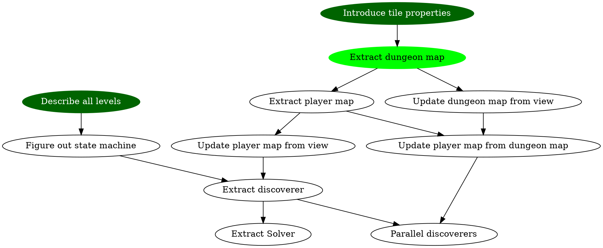

# The Plan



# Experiments

* Drop boulder on enemy
* How far can one carry a boulder?

# The levels

0. A single room
1. A maze
2. Exit hidden behind a door
3. Need to pass two doors in sequence - all doors are visible - only one key accessible
4. Need to pass three doors in sequence - all doors are visible - only one key accessible
5. Need to pass three doors in sequence - one door is hidden - two keys accessible
6. A boulder blocks the exit
7. Place a boulder on a pressureplate (lots of boulders in this level)
8. Avoid being caught by the enemy (some boulders)
9. Stand on pressureplate. Drop the door on the enemy. The enemy will drop the key. (no boulders)
10. Use sword to kill the enemy. The enemy will drop the key?


# "Game" state
```plantuml
[*] --> Idle
Idle --> Exploring
Exploring --> ReconsideringUncheckedBoulders 
ReconsideringUncheckedBoulders --> MovingBoulder
ReconsideringUncheckedBoulders --> Exploring
MovingBoulder --> Exploring
Exploring --> OpeningDoor
OpeningDoor --> Exploring
Exploring --> MovingToExit
Exploring --> [*]
```
