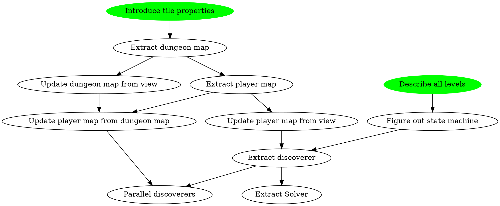

# The Plan



# Experiments

* Drop boulder on enemy
* How far can one carry a boulder?

# "Game" state
```plantuml
[*] --> Idle
Idle --> Exploring
Exploring --> ReconsideringUncheckedBoulders 
ReconsideringUncheckedBoulders --> MovingBoulder
ReconsideringUncheckedBoulders --> Exploring
MovingBoulder --> Exploring
Exploring --> OpeningDoor
OpeningDoor --> Exploring
Exploring --> MovingToExit
Exploring --> [*]
```
